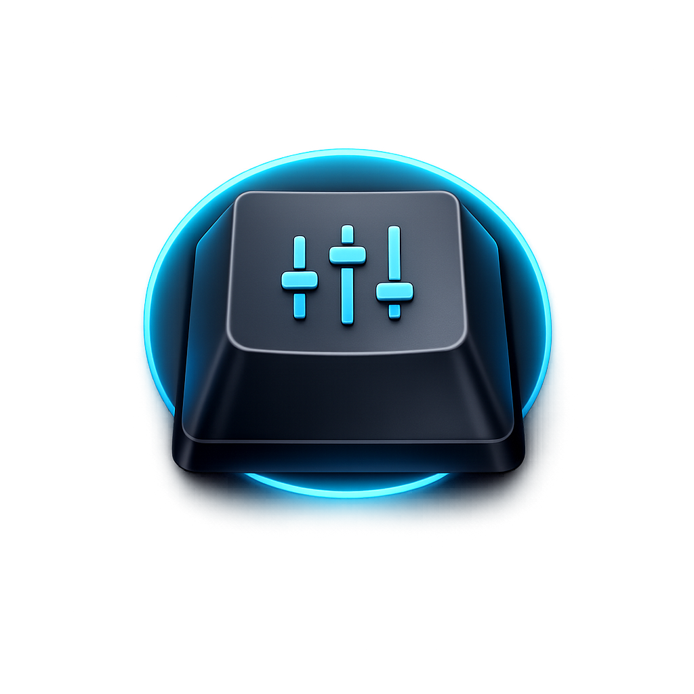

<p align="center">
	
</p>

# Keychron Launcher Wrapper

Minimal Electron desktop utility that opens the official Keychron Launcher in a dedicated app window, with WebHID support for configuring a Keychron K3 Max over wired USB.

## Scope

- Dedicated wrapper app, not a general-purpose browser
- Loads the official Keychron Launcher site
- Uses Electron's embedded Chromium runtime
- Primary target and distribution platform: macOS
- Also runs locally on Windows and Linux (WebHID behavior may vary by OS/runtime support)

## Features

- Single `BrowserWindow` with no tabs, address bar, or bookmarks
- Loads `https://launcher.keychron.com` on startup
- WebHID permission handling through Electron session handlers
- `navigator.hid` runtime validation in the loaded page context
- Domain allowlisting and navigation hardening
- Optional pre-launch hint: connect keyboard by cable before continuing

## Project Structure

```text
.
├── .github/
│   ├── workflows/
│   │   └── build-macos.yml
│   └── copilot-instructions.md
├── assets/
│   └── keychron-launcher-wrapper.png
├── build/
│   ├── entitlements.mac.inherit.plist
│   └── entitlements.mac.plist
├── src/
│   ├── main.js
│   └── preload.js
├── AGENTS.md
├── CHANGELOG.md
├── CONTRIBUTING.md
├── LICENSE
├── README.md
└── package.json
```

## Requirements

- macOS (primary target and packaging)
- Windows and Linux (local runtime support)
- Node.js 20+ (recommended)
- Keychron K3 Max connected by USB cable

## Install

```bash
npm install
```

## Run in Development

```bash
npm start
```

At launch, the app shows a small reminder dialog to connect the keyboard by cable.

### Debug Logging

To troubleshoot HID permission flow and renderer messages, run:

```bash
KEYCHRON_DEBUG=1 ELECTRON_ENABLE_LOGGING=1 ELECTRON_ENABLE_STACK_DUMPING=1 npm start
```

This enables app-level debug logs from the Electron main process plus Chromium/Electron runtime logs.

### DevTools behavior

- In development (`npm start`), DevTools is enabled by default.
- In packaged builds, DevTools is disabled by default.
- To force-enable DevTools in a packaged build for diagnostics, set `KEYCHRON_DEVTOOLS=1` before launch.

## WebHID Permission Handling

The app uses Electron session APIs to keep HID access explicit and scoped:

- `setPermissionCheckHandler`: allows only `hid` and only from allowlisted origins.
- `setPermissionRequestHandler`: denies non-HID requests and non-allowlisted origins.
- `setDevicePermissionHandler`: allows HID device permissions only for allowlisted origins.
- `select-hid-device`: blocks HID selection requests from non-allowlisted frames.

This keeps permissions narrow while preserving Chromium's native device selection flow for allowed pages.

## Navigation Hardening

- Only HTTPS URLs are allowed.
- Only allowlisted hostnames can load in the app.
- `will-navigate` blocks non-allowlisted navigation.
- `setWindowOpenHandler` denies all popup windows.
- Allowed popup URLs are redirected into the single main window.
- Webviews are disabled with `will-attach-webview` prevention.

### Allowlist Override (if needed)

If the official launcher starts depending on additional hostnames, you can extend the allowlist without code changes:

```bash
KEYCHRON_ALLOWED_HOSTS="example-cdn.com,assets.example.com" npm start
```

Use this only for hostnames that are strictly required by the official Keychron Launcher.

## Verify WebHID with Keychron K3 Max

1. Connect the keyboard in wired mode (USB cable).
2. Run the app: `npm start`.
3. Confirm the launcher page loads.
4. In the launcher UI, trigger device connection.
5. Confirm a HID chooser appears and select the Keychron device.
6. Confirm the launcher can read/configure the keyboard.

If `navigator.hid` is unavailable, the app displays a warning dialog after page load.

## macOS Packaging (Starter)

Build scripts are configured with `electron-builder`:

```bash
npm run pack:mac
npm run dist:mac
```

- `pack:mac`: builds an unpacked macOS app directory.
- `dist:mac`: builds distributables (DMG and ZIP).

## Automated DMG Build (GitHub Actions)

This repository includes a workflow at `.github/workflows/build-macos.yml`.

- Trigger on `main`: build artifacts on every push.
- Trigger on tags `v*` or `*.*.*`: publish DMG/ZIP to GitHub Releases.
- Runner: `macos-latest`.
- Output on `main`: `dist/*.dmg` and `dist/*.zip` uploaded as workflow artifacts.
- Output on tags: release assets attached to the corresponding GitHub Release.
- Release notes: extracted from the matching version section in `CHANGELOG.md`.
- Tag releases require Apple signing/notarization secrets in GitHub Actions.

How to download build outputs:

1. Open the repository Actions tab on GitHub.
2. Select the latest `Build macOS DMG` run.
3. Download the artifact named `keychron-launcher-wrapper-macos-<commit-sha>`.

How to publish to GitHub Releases:

1. Create and push a version tag, for example `v0.1.0` or `0.1.0`.
2. The workflow builds macOS artifacts and publishes them to the release for that tag.
3. Ensure `CHANGELOG.md` contains a section like `## [0.1.0]` so release notes are populated.

Required GitHub Actions secrets for signed/notarized releases:

- `CSC_LINK`: base64-encoded `Developer ID Application` `.p12` certificate.
- `CSC_KEY_PASSWORD`: password for the `.p12` certificate.
- `APPLE_API_KEY_BASE64`: base64-encoded App Store Connect API key (`.p8`).
- `APPLE_API_KEY_ID`: App Store Connect API key ID.
- `APPLE_API_ISSUER`: App Store Connect issuer ID.

## Releases

- Official releases: https://github.com/ArtCC/keychron-launcher-wrapper/releases
- Published release artifacts are signed and notarized by Apple when the required signing secrets are configured.

## Limitations and Risks

- This wrapper depends on compatibility between the official Keychron Launcher site and the Chromium version bundled with the selected Electron version.
- Local builds may be unsigned unless you configure signing and notarization in your own environment.
- If the official launcher adds new third-party domains, the allowlist may need updates (or temporary extension via `KEYCHRON_ALLOWED_HOSTS`).
- HID access still depends on OS-level device behavior, cable quality, and keyboard mode/state.

## License

This project is licensed under the [Apache License 2.0](LICENSE).

## Author

GitHub: [ArtCC](https://github.com/ArtCC)

Arturo Carretero Calvo - 2026